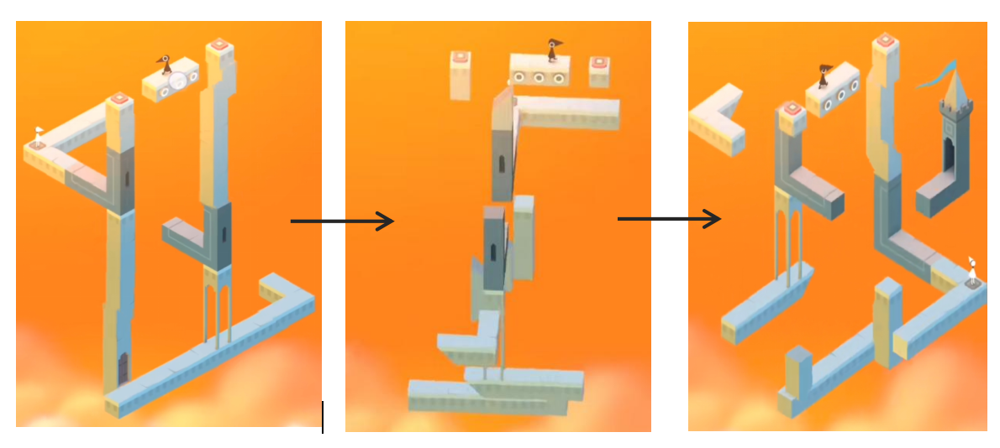

# wxie0333_9103_quiz

## 1.Imaging Technique Inspiration

The above example is from the game "Monument Valley". This game uses 3D graphics to build a map. Players can rotate different angles to form new routes and achieve different effects. This design is full of spatial sense. I was inspired by this and can use p5.js to form a simple graphic combination with simple 3D graphics, and combine mouse movement to form new graphics. Combined with the homework requirements, the creation of this design 3D graphics can be combined with the content of our course, and it can also achieve interaction with people, making the work more interesting.

## 2.Coding Technique Exploration

Based on the imaging techniques above, I found the following coding techniques: 
[Link Text](https://p5js.org/examples//3d-geometries/)
This code uses the p5 WEBGL mode, which includes 7 primitive shapes that can satisfy the above imaging example. The rotation of the three-dimensional figure can be achieved by controlling the rotation by the frame number and rotating along the x, y, and z axes respectively.